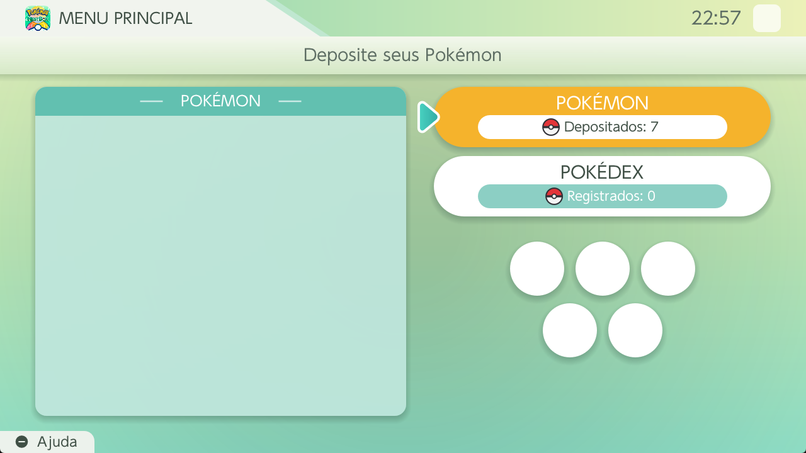
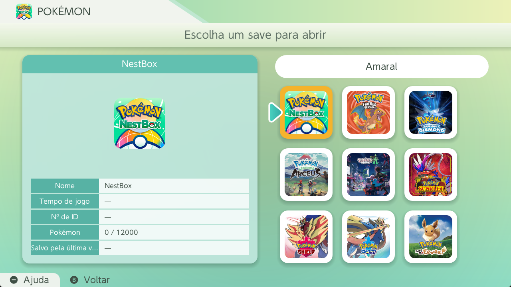
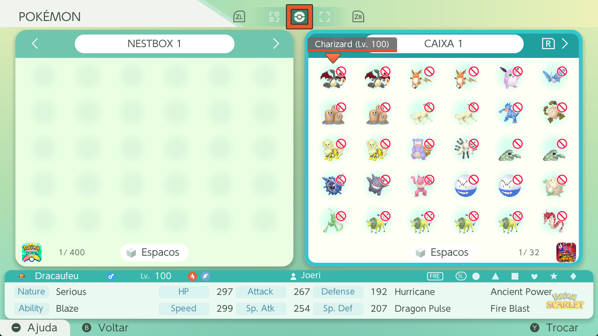
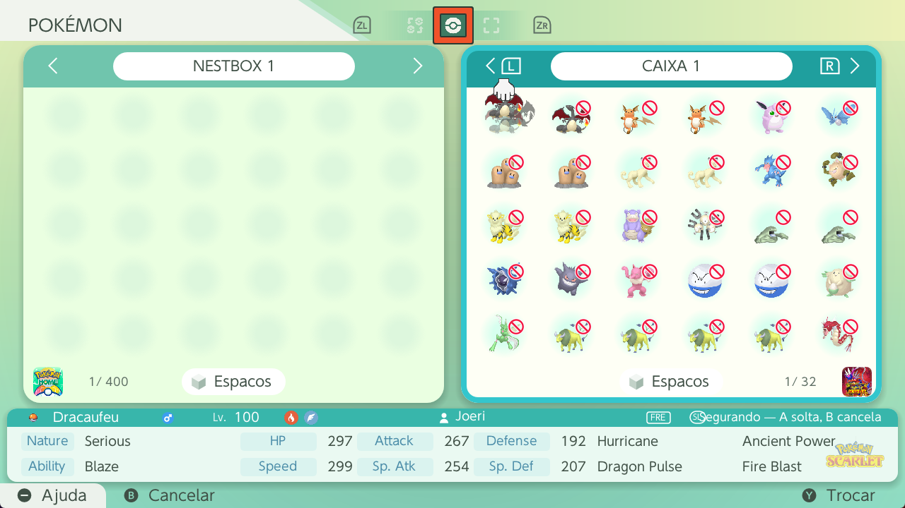
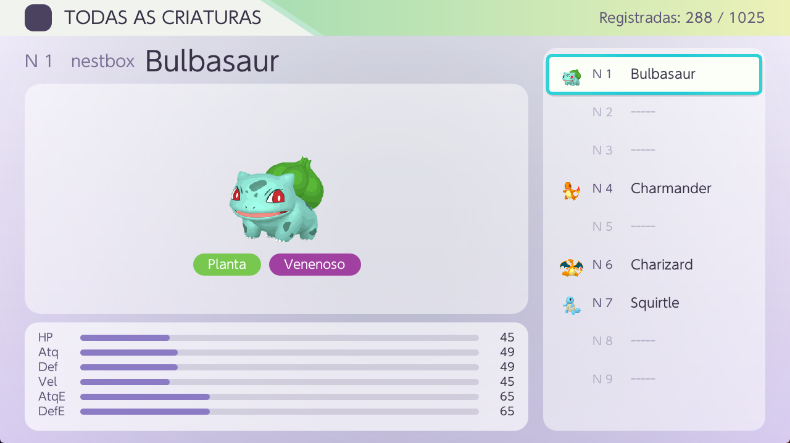

# NestBox

  <b>Um "Pokémon HOME" que roda dentro do próprio Nintendo Switch</b> 
  Homebrew, sem PC, sem nuvem — as caixas na tela do console.

  
  
  

---

## O Charmander que você pegou no FireRed pode viajar

Aquele Charmander que você escolheu no seu FireRed original — o mesmo, com o
mesmo nickname, o mesmo OT, os mesmos IVs — sai da caixa, atravessa
Scarlet, Legends Arceus, Legends Z-A, e **volta pro FireRed** depois. Sem
passar pelo PC, sem sair do Switch: as caixas ficam na tela do console, do
jeito que sempre deveriam ter ficado.

Isso não é planejamento: são **30 rotas medidas** entre 6 jogos, cada uma
conferida na tela. A [tabela de compatibilidade](#compatibilidade--quem-envia-e-quem-recebe)
diz exatamente quais.

## Por que existe

As ferramentas atuais forçam uma escolha ruim:

- **PKHeX, OpenHome, PKVault** rodam no PC. Exigem dumpar o save, levar pro
  computador, mexer e devolver — quebra o fluxo de estar jogando no console.
- **PKSM** roda no Switch e é o mais próximo, mas com interface de homebrew
  antigo.

O buraco é um app **dentro do console**, com visual que não pareça homebrew —
que se pareça com o Pokémon HOME oficial.

## Telas

|  |  |
| --- | --- |
|  |  |
| Menu no estilo do HOME, com NestBox e Pokédex | Escolha do save por capas, como o app oficial |
|  |  |
| Dois painéis lado a lado; ícone vermelho bloqueia incompatíveis | Pegar e mover, com feedback visual |
|  | |
| Pokédex — 1025 espécies registráveis | |

## O que já funciona

- **Leitura de saves de gen 3 a gen 9** — FireRed/LeafGreen, Let's Go,
  Sword/Shield, BDSP, Legends Arceus, Scarlet/Violet e Legends Z-A, tanto de
  emulador quanto de jogos instalados no console.
- **Caixas com sprites**, navegação por controle, dois painéis lado a lado
  como o HOME.
- **NestBox** — o banco central do app: persiste no cartão SD, caixas
  renomeáveis, Pokédex global própria.
- **Transferência real** — mover Pokémon entre o save do jogo e o NestBox.
  Sai de um lado, entra no outro. Escrita no save com backup automático antes.
- **Bloqueio de incompatibilidade** — como o HOME, um Pokémon só se move para
  um jogo se a espécie existir naquele título.
- **Tela de Summary** no formato do HOME oficial, barra de status com dados
  modernos, commit explícito sem janela de perda.
- **Backup e restauração de saves** antes de qualquer escrita.

## Compatibilidade — quem envia e quem recebe

> **O NestBox está em desenvolvimento.** A tabela abaixo é o que está
> **medido**, não uma promessa. A cada versão a compatibilidade se expande.

**42 rotas fechadas entre 7 jogos.** Cada `✓` significa que a transferência
foi feita de verdade e o jogo de destino **desenhou** os Pokémon na tela — não
é dedução a partir do formato do save.

| De \ Para | FireRed | Let's Go | Sword/Shield | BDSP | Legends Arceus | Scarlet/Violet | Legends Z-A |
| --- | :-: | :-: | :-: | :-: | :-: | :-: | :-: |
| **FireRed / LeafGreen** | — | ✓ | ✓ | ✓ | ✓ | ✓ | ✓ |
| **Let's Go, Pikachu! / Eevee!** | ✓ | — | ✓ | ✓ | ✓ | ✓ | ✓ |
| **Sword / Shield** | ✓ | ✓ | — | ✓ | ✓ | ✓ | ✓ |
| **Brilliant Diamond / Shining Pearl** | ✓ | ✓ | ✓ | — | ✓ | ✓ | ✓ |
| **Legends: Arceus** | ✓ | ✓ | ✓ | ✓ | — | ✓ | ✓ |
| **Scarlet / Violet** | ✓ | ✓ | ✓ | ✓ | ✓ | — | ✓ |
| **Legends: Z-A** | ✓ | ✓ | ✓ | ✓ | ✓ | ✓ | — |

Todos enviam e todos recebem, dentro do que cada jogo conhece.

### Quantos Pokémon passam em cada rota

O número não é falha: é **quantos o jogo de destino conhece**. Um Arceus não
entra no Legends Z-A porque o Z-A não tem Arceus, e recusá-lo é o
comportamento certo — o mesmo do HOME oficial.

| Rota | Passam |
| --- | --- |
| BDSP → FireRed | 386 — a Pokédex gen 3 inteira |
| Sword ↔ Scarlet | 420 |
| BDSP ↔ Scarlet | 353 |
| BDSP ↔ Sword | 322 |
| Legends Z-A ↔ Scarlet | 255 |
| BDSP ↔ Legends Arceus | 207 |
| Legends Arceus ↔ Sword | 150 |

### Como a gente sabe que funciona

Não basta o save ficar íntegro. Já aconteceu de tudo passar nos testes, o
arquivo abrir sem erro e **nenhum Pokémon funcionar no jogo** — comparar o
save consigo mesmo é circular.

Por isso cada rota é conferida **na tela do jogo real**, rodando no emulador,
olhando a caixa: se aparecer um ovo no lugar do Pokémon, a rota não fecha.

E não é só "não explodiu". Um Pokémon transferido é submetido ao **PkHeX**, o
verificador de legalidade que a comunidade usa — o mesmo padrão de um Pokémon
capturado no jogo de verdade. O último lote medido: **2814 de 2817**
aprovados, com caixas de todas as origens misturadas em cada jogo.

Os três que sobram são casos de borda do lote de teste (um Pokémon de evento
de raid, dois ovos de nível 1), não das rotas.

---

## Roadmap — a caminho do Pokémon HOME completo

### Feito

- [x] Parser multi-geração (gen 3 → gen 9 / Legends Z-A)
- [x] Interface de caixas, detalhes, enciclopédia e modo lista
- [x] NestBox: banco central persistente, separado por save de origem
- [x] Movimentação real entre save e banco (não cópia)
- [x] Backup automático antes de qualquer escrita
- [x] Bloqueio por incompatibilidade de espécie/jogo
- [x] Commit atômico no fechamento, sem gravação a cada movimento
- [x] Tela de Summary no formato do HOME
- [x] Três modos de cursor com ZL/ZR (vermelho/azul/verde)
- [x] Aviso amarelo de golpe incompatível
- [x] Memória automática de moveset por jogo (restaura o golpe ao voltar a
      um jogo onde o Pokémon já esteve)
- [x] **Let's Go, Pikachu! / Eevee!** nas rotas de transferência
- [x] Mecânicas que viajam junto: tera type derivado na entrada do
      Scarlet/Violet, habilidade oculta re-derivada por jogo, item segurado
      devolvido, forma revertida quando depende de item (Giratina Origin)

### Em desenvolvimento — bugs são esperados

O NestBox ainda está sendo construído, e **bugs vão aparecer**. Cada rota de
transferência é conferida na tela do jogo real antes de fechar, mas nenhum
teste cobre todos os saves, todos os Pokémon e todas as combinações que
existem por aí.

**Se algo der errado, [abra uma issue](../../issues).** Um relato com o jogo
de origem, o jogo de destino e o que aconteceu na tela vale mais que qualquer
suíte de testes — é o tipo de caso que só aparece no uso real.

E vale o de sempre com qualquer ferramenta que escreve em save: **faça backup
antes**. O app cria um automaticamente, mas uma cópia sua fora do cartão é o
que protege contra o caso que ninguém previu.

### Legitimidade é o foco do projeto

Esta é a decisão que mais custou horas de desenvolvimento, e ela orienta todo
o resto: **um Pokémon que passa pelo NestBox tem de ser indistinguível de um
Pokémon que nunca saiu do jogo.**

Não é preciosismo. É o que permite que alguém mova o save de volta para a
sysNAND do console sem levar junto um registro que o jogo — ou um verificador
— consiga apontar como adulterado.

Por isso cada transferência passa pelas mesmas regras que o Pokémon HOME
oficial aplica: moveset recalculado pela engine do jogo de destino, tera type
derivado na entrada, habilidade oculta re-derivada por jogo, item devolvido,
forma revertida quando depende de item segurado. E cada uma dessas regras foi
**medida** contra o comportamento oficial, nunca deduzida.

### Próximas versões

- [ ] **Pokédex completa, separada por jogo** — regiões, formas e variantes,
      em vez da lista global de hoje
- [ ] **Caixa exclusiva da Pokédex** — os Pokémon da coleção ficam separados
      dos que você guardou, sem misturar as duas coisas
- [ ] Troca manual de golpes ao transferir (escolher entre golpes já
      aprendidos — o app hoje só restaura automaticamente pela memória)
- [ ] Judge (avaliação de IVs)

### Criação de Pokémon no console — existe, mas não é o foco

O NestBox tem um gerador capaz de montar um Pokémon direto na tela do
console: espécie, natureza, habilidade, IVs, golpes.

**Ele não é o propósito do projeto, e é por isso que continua desligado.** A
ideia central do NestBox é preservar a legitimidade do que passa por ele —
qualquer coisa que crie Pokémon do nada anda na direção oposta. Quando o
gerador for liberado, será claramente separado do fluxo de transferência,
para que quem quiser manter o save legítimo simplesmente não o use.

O caminho já existe e é o mesmo da transferência: as mesmas regras de
compatibilidade, o mesmo verificador, a mesma escrita com backup.

### Fora de escopo (por design)

- Trocas online / GTS / Wonder Box / Room Trade
- Sincronização em nuvem — tudo vive no cartão SD do console

---

Espero que a comunidade goste do projeto e que ele cresça — e que isso abra
espaço para mais conteúdo e mais ferramentas para quem vive nesse ecossistema.

## Instalação

1. Baixe o `nestbox.nro` da [última release](../../releases/latest)
2. Copie para `sdmc:/switch/`
3. Abra pelo homebrew launcher

> **Abra em application mode**: no menu HOME, segure `R` e abra um jogo
> qualquer. Pelo álbum, o homebrew recebe só ~448 MB e não alcança os saves
> dos jogos instalados. O app avisa quando está no modo limitado.

## Controles

| Botão | Ação |
| --- | --- |
| D-pad | mover o cursor |
| `L` / `R` | trocar de caixa |
| `ZL` / `ZR` | alternar entre NestBox e save |
| `Y` | pegar / soltar Pokémon |
| `X` | enciclopédia |
| `R3` | modo lista |
| `B` | voltar / sair |

## Sobre este repositório

Este repositório é um **espelho de leitura do código-fonte**, publicado a cada
release para quem quiser inspecionar como o app funciona — em especial como ele
lê e escreve os saves, já que é o tipo de coisa que ninguém deveria rodar no
seu save sem poder auditar.

**Ele não compila sozinho.** Os assets de jogo (sprites, arte da interface)
não são distribuídos aqui: são propriedade da The Pokémon Company e existem
apenas embutidos no `.nro` da release. As screenshots acima são do próprio
app em uso, mantidas à parte. O desenvolvimento acontece em um repositório
privado.

| Diretório | Conteúdo |
| --- | --- |
| `source/core/` | Parsers e regras — C++ puro, sem dependência de plataforma |
| `src/ui/` | Interface (borealis) |
| `src/cli/` | Ferramenta de linha de comando para inspecionar saves |
| `tests/` | Suíte de testes do core |

O core não depende de libnx: compila no PC e no Switch sem alteração. É o que
permite testar os parsers sem hardware.

## Créditos

O formato dos saves e dos Pokémon foi documentado a partir da pesquisa do
[PKHeX](https://github.com/kwsch/PKHeX) e do
[Project Pokémon](https://projectpokemon.org/). O PKHeX foi usado como
**referência de leitura**: os formatos foram lidos e reimplementados do zero
em C++. Nenhum código do PKHeX é copiado ou linkado.

Ver [CREDITS.md](CREDITS.md) para o detalhamento.

## Aviso

Ferramenta para uso pessoal com seus próprios jogos e saves. **Faça backup
dos seus saves.** Este projeto não é afiliado à Nintendo, Game Freak ou The
Pokémon Company.
